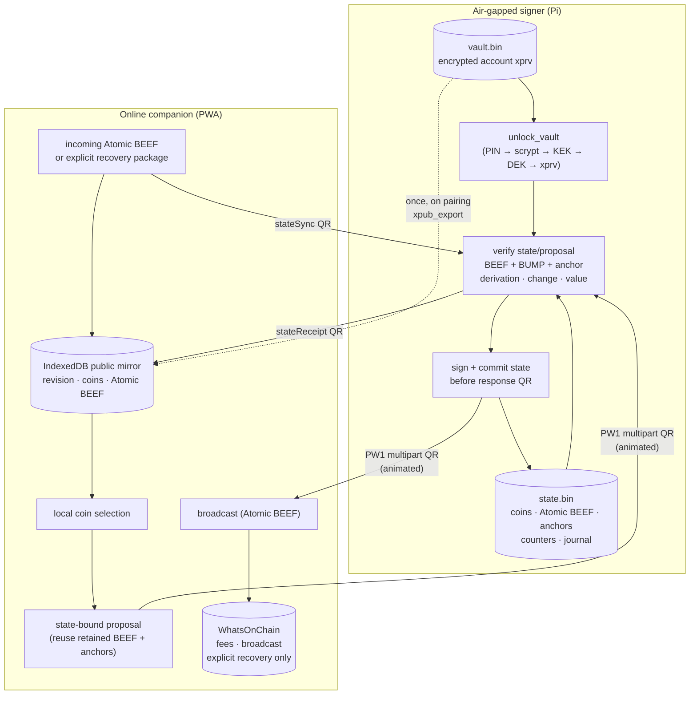

# Architecture

This chapter is the engineering tour: what the two halves of
PiWalletSV actually do, what they're allowed to know, and how the
trust boundary between them is enforced.

If you just want to use the device, skip to the
[User manual](user-manual.md). If you want to build a compatible
companion or signer, the [Protocol spec](protocol/README.md) is the
normative source; this chapter explains the "why" behind it.

## 1. Two hosts, one wallet

PiWalletSV is a **two-host system**:



The horizontal arrows are the **only** channel between the two
hosts. They carry:

| Envelope kind        | Direction              | Volume                  |
| -------------------- | ---------------------- | ----------------------- |
| `xpub_export`        | Pi → companion         | ~0.2 KB, once per wallet|
| `unsigned_proposal`  | companion → Pi         | ~1–10 KB, per send      |
| `signed_tx`          | Pi → companion         | ~0.3–2 KB, per send     |
| `state_sync`         | companion → Pi         | transaction-sized, per receive/migration |
| `state_receipt`      | Pi → companion         | small state delta       |

No master keys ever cross the boundary. Public transaction state is mirrored,
but the Pi is authoritative: only a Pi-authored receipt advances companion
state. See [Persistent wallet state](protocol/wallet-state.md).

## 2. Why this split

A signing device needs three properties to be useful:

1. **Confidentiality.** The private keys never leave the device.
2. **Verifiability.** The user can see what they're signing before
   it gets signed.
3. **Availability.** The user can actually transact — discover
   their UTXOs, build a transaction, get it onto the chain.

A pure cold wallet has (1) and (2) but not (3); a pure hot wallet
has (3) but is one drive-by exploit away from losing (1). The
split-host design hands (3) to a fully-online piece (the companion)
and lets the cold piece focus on (1) and (2).

The catch is that the online piece is now **untrusted** — it might
be compromised, it might be honest-but-broken, it might be talking
to a tampered backend. So the cold piece can't just believe what
the online piece tells it. It has to verify every claim against
something the user has confirmed.

That "something the user has confirmed" is, ultimately, the BUMP
Merkle path inside each input's BEEF resolving to a Merkle root the
companion explicitly anchored at the path's claimed height. The Pi
takes the anchor map on faith from the companion (which sourced it
from a block-explorer); every other check (BEEF parse, BUMP root
recomputation, derivation match, change re-derivation, value
conservation) chains off that match. See
[SPV requirements](protocol/spv.md) §1 for the trust-model
discussion and §2 for the exact verification rules,
[SPV §"Threat model"](protocol/spv.md#8-threat-model-summary) for
what kind of attacks this defeats and what it does not.

## 3. The data flow, walked through

A real send looks like this:

1. **Pairing (once).**
    - On the Pi: `piwallet xpub-export` reads the wallet's account
      xpub at `m/44'/236'/0'`, wraps it in an `xpub_export`
      envelope, gzips + CBORs it, frames it as `PW1` multipart QR
      lines.
    - In the companion: the `/#/scan` page assembles the PW1
      frames, decodes the envelope, verifies the 4-byte
      self-fingerprint matches a locally recomputed value, and
      offers a "Save as paired wallet" card that writes
      `{label, xpub, fingerprint, path, addedAt}` to IndexedDB.

2. **Receive.**
    - The companion derives `m/0/<nextReceiveIndex>` from the
      account xpub, displays the base58 P2PKH address as text and
      QR, and the user shares it.
    - A confirmed sender-delivered Atomic BEEF package is staged on the
      companion. During legacy migration only, the explicit Advanced recovery
      walker discovers transactions and builds the same package.
    - The Pi verifies the output, derivation, BUMP, height, and anchor, commits
      it to encrypted state, and returns a receipt that advances the companion
      mirror.

3. **Send.**
    - User taps "Send" on the wallet detail page, enters a
      recipient address and amount.
    - Balance and confirmed input selection read only the Pi-authored mirror.
      No address lookup or gap walk runs on refresh or send.
    - Live fee rates are fetched from WoC's
      `GET /feerecommendation` and presented as Economy / Standard
      / Priority tiers (100 sat/kB BSV recommended default; used
      as fallback when the endpoint is unreachable).
    - Greedy coin selection picks from the confirmed UTXOs and
      computes the fee under a P2PKH byte model.
    - For each selected UTXO, the proposal reuses the BEEF and header anchor
      already verified and retained during the receive/recovery transition.
    - The proposal builder packages `{walletFp, inputs, outputs,
      changeIndex, changeDerivation, feeRate, locktime,
      headerAnchors, stateRevision, stateHash, proposalId}` into an
      `unsigned_proposal` envelope. The envelope is gzipped + CBORed,
      framed as PW1, and animated on a canvas.

4. **Verify and sign (Pi).**
    - User points the Pi's camera at the animated QR canvas.
    - `piwallet qr scan-camera` collects frames until the PW1
      assembler completes.
    - `verify_proposal()` runs the rules from
      [SPV requirements](protocol/spv.md) §2: for every input,
      parse the BEEF, recompute the BUMP path's Merkle root, look
      up the matching anchor in `headerAnchors[block_height]`, and
      reject any mismatch; then re-derive the signing key, check
      value conservation, and re-derive the change script.
    - If anything fails, the bonnet shows a one-line reason and
      the signing path exits. No partial state is kept.
    - If everything passes, the bonnet shows the recipient
      address, amount, fee, and per-input height + anchored-root
      prefix. The user holds A to confirm.
    - `sign_transaction()` derives the per-input signing keys from
      the (still-unlocked) account xprv, signs each input, builds
      the raw tx, then wraps the tx + each input's BEEF as a
      single **BRC-95 Atomic BEEF** blob, returned in the
      `signed_tx` envelope.
    - Before showing that QR, the Pi removes consumed coins, adds pending
      change, advances the counter/revision, stores the signed Atomic BEEF and
      replay record, then atomically replaces `state.bin`.

5. **Broadcast.**
    - Companion's `/#/scan` page assembles the `signed_tx`,
      verifies the `walletFp` matches the proposal it sent,
      splits the Atomic BEEF wrapper to recover the subject TXID
      + raw tx, displays the txid + amount, and offers a
      "Broadcast" button.
    - On click, the companion `POST`s the raw hex to
      WhatsOnChain's broadcast endpoint (`POST /tx/raw`), surfaces
      the returned txid, and warns if it differs from the one the
      Atomic BEEF wrapper declared (a hint at tx malleability).
    - Transaction history is rebuilt locally from retained Atomic BEEF and
      issued derivation counters; it performs no address lookup.

The user never sees a master key, never enters a password into a
networked machine, and never authorises a payment without seeing the
exact destination on a device that only displays what it has
cryptographically verified.

## 4. Trust boundary

A useful way to summarise:

| Asset                          | Pi          | Companion   |
| ------------------------------ | ----------- | ----------- |
| BIP39 mnemonic (cleartext)     | RAM only, signing-path-scoped | never |
| Master xprv (cleartext)        | RAM only, signing-path-scoped | never |
| Vault file (encrypted xprvs)   | disk (`~/.piwallet/vault.bin`) | never |
| Wallet state (encrypted)       | disk (`~/.piwallet/state.bin`) | public mirror only |
| PIN                            | RAM only, prompt-scoped | never |
| Account xpub                   | disk (Pi) + IndexedDB (companion) | yes |
| Receive / change addresses     | derived on demand | derived on demand |
| Coins / derivation counters    | authoritative encrypted state | Pi-authored mirror |
| Block-header merkle roots      | retained by height in encrypted state | mirrored after receipt |
| Merkle proofs (BUMP, embedded in BEEF) | retained and reused | mirrored after receipt |
| Signed transactions (Atomic BEEF) | persisted before QR | yes (received via QR) |

The companion holds **public data only**. Its IndexedDB mirror can be wiped
without losing keys or funds (Safari ITP may purge it after ~7 days of idle
browser use), but the mirror must then be restored from a companion Settings
export or Pi-authored state receipts, or rebuilt through explicit recovery.
The Pi's vault is the source of private material; `state.bin` is the source of
transaction facts; the BIP39 mnemonic on paper (or steel) outside the device
is the key-recovery channel.

## 5. Module layout

```
.
├── piwallet/                     # offline core (Python, runs on Pi)
│   ├── core/
│   │   ├── mnemonic.py           # BIP39 generate / validate / to_seed
│   │   ├── derivation.py         # BIP32 + BIP44 + P2PKH addresses
│   │   ├── envelope.py           # CBOR + gzip codec (5 message kinds, v2)
│   │   ├── vault.py              # scrypt → KEK → DEK → AES-GCM xprv
│   │   ├── state.py              # encrypted coins/BEEF/anchors/journal
│   │   ├── atomic_beef.py        # BRC-95 Atomic BEEF wrap / split
│   │   ├── verify.py             # BEEF + BUMP-root ↔ anchor check + derivation
│   │   └── sign.py               # change re-derive + sign + Atomic BEEF
│   ├── backup/                   # USB vault + state export/import
│   ├── bonnet/                   # on-device UI flows (wallet list, USB backup, sign)
│   ├── qr/multipart.py           # PW1 framing + assembler
│   ├── ui/                       # bonnet display + joystick widgets
│   └── cli.py                    # piwallet entry point
│
├── companion/                    # online half (TypeScript + Vite + PWA)
│   └── src/
│       ├── lib/
│       │   ├── envelope.ts       # CBOR + gzip codec (mirrors Python, v2)
│       │   ├── wallet-state.ts   # Pi-authoritative public mirror + local history
│       │   ├── pw1.ts            # PW1 framing
│       │   ├── derive.ts         # BIP32 + P2PKH (scure + noble)
│       │   ├── woc.ts            # WhatsOnChain client — UTXOs, proofs, fees, broadcast
│       │   ├── bitails.ts        # Bitails client — tx history with inline sat amounts
│       │   ├── utxo.ts           # explicit history-aware disaster recovery
│       │   ├── history.ts        # legacy/recovery history helpers
│       │   ├── fee.ts            # fee rate recommendation (WoC /feerecommendation)
│       │   ├── coin-select.ts    # greedy P2PKH coin selection + dust
│       │   ├── proof-fetcher.ts  # TSC → MerklePath + per-block header lookup + BEEF
│       │   ├── proposal.ts       # build_unsigned_proposal (+ headerAnchors map)
│       │   ├── wallets.ts        # IndexedDB store (schema v3)
│       │   └── terms.ts          # disclaimer acceptance state
│       └── app/                  # UI pages: wallets / detail / scan / settings
│
├── tests/                        # Python tests + canonical fixtures
│   └── fixtures/
│       ├── addresses_canonical.json
│       ├── proposal_01.cbor
│       ├── proposal_01.json
│       └── proposal_01_decoded.json
│
├── scripts/
│   ├── camera_qr_test.py
│   ├── dump_decoded_envelope.py
│   ├── rgb_display_pillow_bonnet_buttons.py
│   ├── st7789_solid_fill_test.py
│   └── usb-backup-smoke.sh       # host-side backup bundle smoke test
│
└── docs/
    ├── index.md getting-started.md architecture.md
    ├── user-manual.md develop.md security.md disclaimer.md
    ├── brc-alignment.md          # which BRCs we conform to (and don't)
    └── protocol/                 # interop spec (v2)
        ├── envelopes.md spv.md
        └── ...
```

The Python and TypeScript halves share **only** the bytes of the
canonical fixtures in `tests/fixtures/`. They have no shared code,
no IDL, no schema registry. Both halves have their own tests; the
TypeScript test suite additionally decodes the Python-produced
`proposal_01.cbor` to catch wire-format drift.

## 6. Dependency choices

- **Python core**:
    - [`bsv-sdk`](https://github.com/bsv-blockchain/python-sdk) — BSV
      primitives: `Transaction`, `MerklePath`, BEEF, `P2PKH`.
      Provides `bsv.hd.Xprv` for BIP32 and `bsv.hash160` for the
      fingerprint primitive.
    - [`cbor2`](https://github.com/agronholm/cbor2) — RFC 8949 encode/decode.
    - [`cryptography`](https://github.com/pyca/cryptography) — AES-GCM and
      scrypt for the vault.
    - [`click`](https://click.palletsprojects.com/) — CLI framework.

- **Companion**:
    - [`@bsv/sdk`](https://www.npmjs.com/package/@bsv/sdk) — BSV
      primitives in TypeScript, parallel to the Python `bsv-sdk`.
      Chunked separately in the Vite bundle for caching.
    - [`@scure/bip32`](https://www.npmjs.com/package/@scure/bip32) +
      [`@noble/hashes`](https://www.npmjs.com/package/@noble/hashes) +
      [`@scure/base`](https://www.npmjs.com/package/@scure/base) —
      audited primitives for BIP32 derivation, SHA-256, RIPEMD-160,
      and Base58Check.
    - [`cbor-x`](https://www.npmjs.com/package/cbor-x) — CBOR codec
      configured to mirror the Python output (Map-based, no tags).
    - [`qrcode-generator`](https://www.npmjs.com/package/qrcode-generator) +
      [`jsqr`](https://www.npmjs.com/package/jsqr) — animated QR render
      + camera-side decode.
    - Browser-native [`CompressionStream`](https://developer.mozilla.org/en-US/docs/Web/API/CompressionStream)
      for gzip. No third-party gzip library in the bundle.

Everything is permissively licensed (MIT / Apache-2.0).

## 7. First-load disclaimer

The companion blocks every page render until the user has
acknowledged the current `DISCLAIMER.md`. The state machine lives in
[`companion/src/lib/terms.ts`](https://github.com/mohrt/PiWalletSV/blob/main/companion/src/lib/terms.ts);
the blocking modal lives in
[`companion/src/app/terms-modal.ts`](https://github.com/mohrt/PiWalletSV/blob/main/companion/src/app/terms-modal.ts).
`localStorage` persists the version + timestamp; bumping
`CURRENT_TERMS_VERSION` re-prompts every user on next load.

A first-boot disclaimer on the Pi side (3-page bonnet flow with
hold-A confirmation, persisted to vault metadata) is part of Phase 2
and not yet shipped.

## 8. Versioning and stability

- **Protocol version**: tracked in the envelope's `v` field and the
  QR magic. v2 is the current line; v1 producers are intentionally
  rejected (no compat shim) so out-of-sync producers fail loudly.
  A future v3 would land in `docs/protocol/v3/` and run alongside v2
  during a deprecation window. See
  [Protocol overview](protocol/README.md) §"Stability promise."
- **Software version**: tracked in `pyproject.toml`'s `project.version`
  and `companion/package.json`'s `version`. The two are kept in
  lock-step for releases.
- **Disclaimer version**: tracked in `DISCLAIMER.md`'s
  `termsVersion: 1` line and `companion/src/lib/terms.ts`'s
  `CURRENT_TERMS_VERSION` constant. Bumping requires every user to
  re-acknowledge.

## 9. What this architecture does not solve

- **A user who confirms a transaction without reading the bonnet
  screen.** The Pi displays the recipient, amount, fee, and
  per-input height + anchored-root prefix for exactly this reason
  — they are only useful if the human looks.
- **A malicious or compromised block-explorer that fabricates a
  `(height, merkle_root)` anchor.** The Pi will sign such a
  proposal; the broadcast then fails (the input doesn't exist on
  chain). Funds and keys remain safe, but the user wastes the
  click. See [SPV requirements](protocol/spv.md) §1 for the
  trust-model rationale.
- **A user who entered a wrong address on the companion in the
  first place** (e.g., the companion got phished into displaying a
  swap-replaced address during a copy-paste). The signer can only
  verify that the bytes it sees on its screen are what's about to
  be signed; it has no way to know what address the user *meant*.
- **A user whose seed phrase is exposed elsewhere** (photographed,
  uploaded to cloud notes, etc.). The signer's job ends at the
  vault boundary; everything outside it is the operator's
  responsibility.

These are user-procedural risks, not protocol risks. The
[User manual](user-manual.md) and [Security](security.md) chapters
spell out the procedural mitigations.
