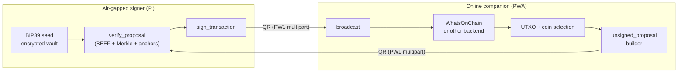

# PiWalletSV

!!! warning "Alpha software"
    PiWalletSV is in active development. There is no warranty and no
    custodial backup. Read the [Disclaimer](disclaimer.md) and
    [Security policy](security.md) before storing real funds on a
    device built from this code.

PiWalletSV is an **air-gapped Bitcoin SV signing device** built from
off-the-shelf parts:

- a Raspberry Pi Zero 2 WH,
- an Adafruit 1.3" 240×240 TFT bonnet with a joystick and two buttons,
- a Pi Camera Module 3 for reading animated QR codes,

paired with a **browser-based companion PWA** that runs on your
phone, tablet, or laptop. The companion handles every online
operation — UTXO discovery, header fetching, proof assembly,
broadcast — and ferries unsigned transactions to the signer over
animated QR codes. The Pi never touches a network.

## What this site covers

-   :material-rocket-launch: __[Getting started](getting-started.md)__

    Bring up the bonnet, install the signer, run the companion in a
    browser. Start here if you've just got the hardware.

-   :material-shape: __[Architecture](architecture.md)__

    The two-host design, the trust boundary, the data flow, and why
    everything that crosses the air gap is gzipped CBOR over
    animated QR.

-   :material-account-tie: __[User manual](user-manual.md)__

    Pairing, receiving, sending, broadcasting, restoring. The same
    journey a normal user would take.

-   :material-code-tags: __[Develop](develop.md)__

    Repo layout, dev setup, testing matrix, fixture regeneration,
    release checklist.

-   :material-shield-key: __[Security](security.md)__

    Threat model, reporting channels, supported versions, operator
    hardening notes.

-   :material-file-document-multiple: __[Protocol spec](protocol/README.md)__

    The wire formats, QR transport, derivation rules, and SPV
    requirements that any compatible companion (or signer) must
    follow.

## Two halves

The system is intentionally split into two pieces that never share a
trust boundary:

The companion is online but **semi-trusted**: every claim it makes
(which UTXOs you have, how much each is worth, which address is
"change") is cryptographically re-verified on the signer using
BEEF proofs anchored to user-displayed block headers. A malicious
companion cannot exfiltrate keys or trick the signer into producing
a signature on a transaction that pays the wrong place.

## Build a compatible companion

The wire format, QR transport, derivation rules, and SPV
requirements are documented as an open spec in the
[Protocol spec](protocol/README.md) chapter. Canonical test vectors
live in [`tests/fixtures/`](https://github.com/example/piwallet/tree/main/tests/fixtures)
on GitHub. Any project that follows the spec can pair with a
PiWalletSV signer — there's no proprietary handshake.

## Project status

| Phase | Scope | Status |
| ----- | ----- | ------ |
| 1 | Offline core (mnemonic, derivation, envelope, vault, verify, sign, CLI) | done |
| 2 | Pi-side bonnet UX (display, joystick word entry, first-boot disclaimer) | in progress |
| 3 | Python + TypeScript PW1 multipart transport | done |
| 4 | Companion PWA (pairing, receive, UTXO scan, proposal, broadcast, terms) | done |
| 7 | Documentation site + protocol spec + v0.1 release | this site |
| 8 | Enclosure, tamper-evidence, first-boot hardening, signed SD image | planned |

See the [README](https://github.com/example/piwallet) for the
current source state.
