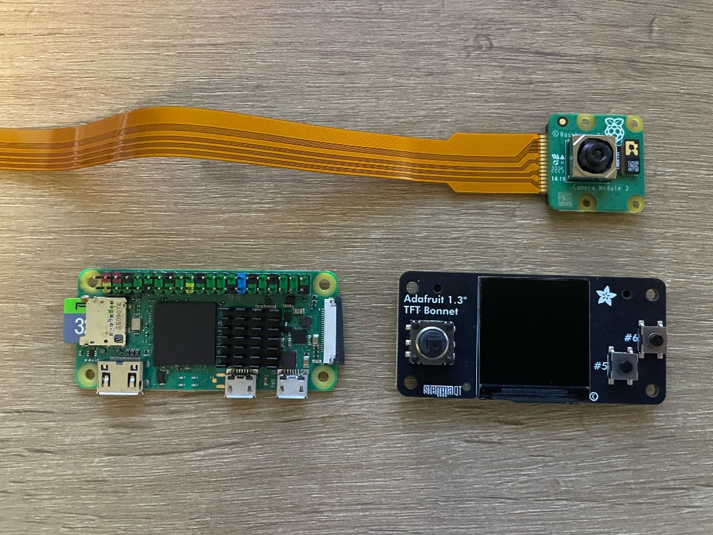

# PiWalletSV case — design spec

> Loop 1 deliverable. Locks the geometry, port locations, and assembly
> approach so `case.scad` (Loop 2) has a single source of truth to
> build against. Decisions made under "Decision log" below should not
> be revisited without amending this file.

The PiWalletSV reference case is a **2-piece clamshell PETG
enclosure**, SeedSigner-style, that holds a Raspberry Pi Zero 2 W,
an Adafruit 1.3" 240×240 TFT bonnet (product 4506), and an Arducam
OV5647 Mini camera (Arducam B0033 / ASIN B01LY05LOE), with the LCD
facing the operator and the camera lens
facing the back of the unit on the same optical axis.

The two pieces are:

- **`back_tub`** — the deep half. Full side walls, integrated
  camera mount posts, Pi-corner standoff posts, lens cone,
  tamper-sticker recess, Pi I/O cluster cutouts (PWR-IN + OTG by
  default; HDMI optional) on the FRONT side wall, microSD-slot
  cutout on the LEFT short edge.
- **`front_lid`** — the shallow half. A 2.4 mm slab carrying the
  LCD window, joystick + button cutouts, and four screw-clearance
  holes, plus a thin skirt that drops into a registration step on
  the back tub's top inner edge. The skirt takes shear load so the
  lid can't slide sideways under the screws.

External envelope as the SCAD currently resolves it: **~87 × 52 ×
39.8 mm** (`case_x × case_y × case_z`). Roughly a deck-of-cards
footprint stood on its short edge. Re-printable, opens with four
M2.5 × 16 mm screws, no glue. Each dimension is a function of the
named variables in `case.scad`; shrinking the envelope is a matter
of revisiting the screw lanes (currently 7 mm each side) and the
front/back lanes (currently 7 mm each — front carries the I/O cutouts, back is currently sealed) rather than the
cavity itself, which is fixed by the bonnet/Pi/camera footprints
plus the ribbon U-turn clearance.

## Hardware footprints (canonical numbers)

All measurements are nominal from manufacturer datasheets. The SCAD
file applies a `clearance` offset (default 0.4 mm) to every internal
cavity so FDM tolerances don't bind the parts.

### Raspberry Pi Zero 2 W

| Property | Value |
|---|---|
| Board outline | 65.0 × 30.0 mm |
| Board thickness (PCB only) | 1.0 mm |
| Tallest topside element (HAT header tip) | 8.5 mm |
| Tallest underside element (SD slot lip) | 1.5 mm |
| Mounting hole pattern | 58.0 × 23.0 mm (4 holes, M2.5 clearance, 2.7 mm dia) |
| Hole inset from corners | 3.5 mm in both axes |
| CSI port location | long edge, 12 mm from SD-slot end, ribbon points away from bonnet |
| microSD slot | short edge, projects ~2 mm beyond board |

### Adafruit 1.3" TFT Bonnet (product 4506)

| Property | Value |
|---|---|
| Overall assembled (Adafruit spec) | 65.5 × 30.6 × 15.2 mm |
| Board outline (effective for the cavity) | 65.5 × 30.6 mm |
| Pi PCB bottom → LCD top (with bonnet seated) | 14.0 mm (measured 2026-05-15) |
| GPIO connector | 2×20 female socket on the bonnet's back face, mates with the Pi's 40-pin GPIO header |
| Pi I/O cluster (mini-HDMI, micro-USB OTG, micro-USB PWR-IN) | on the Pi (long edge opposite GPIO). When stacked, this lands on the bonnet's "stemmaQT"-labelled long edge — the FRONT (low y) edge in our case-frame. Port centres in bonnet-frame: `hdmi_x_offset ≈ 12.4`, `usb_data_x_offset ≈ 41.0`, `usb_pwr_x_offset = 54.0`. Default exposes PWR + OTG + microSD; HDMI sealed (toggle `hdmi_cutout_enabled` for dev). |

LCD, joystick, and button positions are listed in the **Confirmed
dimensions** section below (sourced from Adafruit's official 4506
STEP file in `hardware/case/refs/`, cross-verified with calipers).
Don't trust any other "Adafruit learn page" tables for these — the
ones we found in the wild were off by several millimetres.

### Camera: Arducam OV5647 Mini (Arducam B0033 / Amazon ASIN B01LY05LOE)

Selected over the Pi Camera Module 3 because (a) it's ~$9 vs ~$25,
(b) it has 4 corner mounting holes on the PCB (the Pi Zero W camera
ships with no through-board mount), (c) it ships with both a 15-pin
1 mm ribbon and a 15-pin↔22-pin adapter for the Pi Zero CSI port, and
(d) the OV5647 sensor is the same one SeedSigner uses for QR
scanning, so software compatibility (`libcamera`, `raspicam`) is
proven for our use case. Auto-focus is not needed for held-up
QR-code scans at typical phone-screen distance.

> **All values in this section are pending caliper verification on
> arrival.** Arducam does not publish a precise mechanical drawing
> for this module, and one Amazon reviewer specifically called out
> that the corner hole pattern does NOT match the official Raspberry
> Pi Zero W camera case mounts. So the numbers below are reasonable
> starting estimates; treat them as provisional until measured.

| Property | Estimate (verify) | Notes |
|---|---|---|
| Module outline | ~24 × 25 mm | OV5647-mini class PCBs sit roughly in this envelope |
| Module thickness (with lens housing) | ~9.5 mm | shorter than v3 (no autofocus stack); savings can grow `ribbon_under_pi` |
| Mounting hole pattern | ~21 × 12.5 mm pitch (estimate) | 4 corner holes; **measure** — the pattern is reportedly Arducam-specific, not Pi-standard |
| Mounting hole diameter | ~2.2 mm | M2 clearance is the most common Arducam-mini choice |
| Lens centre on PCB | ~(12, 12.5) mm | biased toward one edge — measure once it arrives |
| Lens outer diameter (housing) | ~7 mm | drives `lens_cone` diameter on the back wall |
| Ribbon connector | 15-pin 1 mm pitch on camera side | identify which edge it exits to fix the U-turn anchor |
| Cables in box | 15 cm 15-pin (Pi A/B/3) + **15 cm 15-pin↔22-pin (Pi Zero CSI)** | the second one is what we use |
| Cable lengths in the wild | 15 cm (in box) is overlong for our 87 mm enclosure; Arducam B085RW9K13 cable set offers 38 mm / 73 mm / 150 mm — the 38 mm is shorter than the 50 mm target and gives a clean U-turn |

### CSI ribbon U-turn

The ribbon comes out of the Pi's CSI ZIF (Pi's right short edge,
button end of the case), bends down past the Pi's right edge, runs
under the Pi inside the back tub, and plugs into the camera's FFC
socket which faces the same right side. The clear vertical slot for
this U-turn is `ribbon_under_pi = 6.0 mm` between the camera
module's top and the Pi PCB's bottom — enough for a ~3 mm radius
bend on the 0.5 mm-pitch flex without cracking it over time.

The Arducam B0033 ships with a **15 cm 15-pin↔22-pin Pi-Zero
adapter cable** in the box, so no separate adapter purchase is
required for assembly. 15 cm is overlong for our 87 mm enclosure
and will need to fold neatly into the cavity on first assembly; for
a cleaner fit, source the **Arducam B085RW9K13 cable set** (38 mm /
73 mm / 150 mm) and use the 38 mm cable. Confirm any shorter cable
still clears the U-turn radius before committing to it.

## Assembly stack-up

```
+----------------------------------------+   ← front face (operator)
|  FRONT LID (2.4 mm slab)               |
|    LCD window (24.5 × 24.5 mm)         |
|    LCD bezel recess (1.0 mm deep)      |
|    joystick well + silicone pocket     |
|    button A + B cutouts (Ø 4)          |
|    M2.5 screw clearance ×4             |
|    skirt (4 mm tall, 1.2 mm thick)     |
+----------------------------------------+   ← seam: lid skirt → tub step
|  BONNET (LCD up, joystick L, btns R)   |   z ≈ 22.5–37 (case-frame)
|     2×20 GPIO socket on bonnet back ←──┐
+----------------------------------------+│
|  PI ZERO 2 W (chip up, GPIO into       ├─ pi_pcb_to_lcd_top = 14
|  bonnet socket)                        │
+----------------------------------------+   ← Pi PCB bottom @ z ≈ 22.9
|  RIBBON U-TURN SLOT (6 mm clear)       |
+----------------------------------------+   ← camera top @ z ≈ 14.9 (v3 was 16.9)
|  CAMERA — Arducam OV5647 mini          |
|  (lens-back, FFC right)                |
+----------------------------------------+   ← camera bottom @ z ≈ 5.4
|  CAMERA POSTS (3 mm) + Pi STANDOFFS    |   ← back tub interior floor
|  in BACK TUB                           |
|    lens cone (Ø 8, 3 mm cone recess)   |
|    Pi standoffs ×4 (M2.5 self-tap)     |
|    camera mount posts ×4 (M2 self-tap) |
|    PWR + OTG cutouts (front side wall) |
|    HDMI cutout (front, sealed default) |
|    SD cutout (left side wall)          |
|    tamper-sticker keep-out             |
+----------------------------------------+   ← back face (target)
```

### Mating

**Press-fit, no screws.** The front lid's 4 mm tall skirt drops into
the back tub's matching stepped lip (`lid_skirt_step = 1.2 mm` on
each side) and is held by friction alone. The user confirmed in
Loop 1 that the fit is already "very nice and tight" at the standard
`clearance = 0.4 mm` value — no fasteners needed. To open the case,
flex the long edges gently outward and lift the lid.

Screw lanes (the 7 mm wide solid strips that previously flanked the
cavity to host M2.5 bosses) have been removed. The case rim is now
`wall` (2.4 mm) thick on every edge, matching the lid face slab.
External footprint dropped from ~87 × 52 mm to ~73 × 38 mm.

Tamper-evident shipping: a single 12×6 mm sticker bridges the
front-to-back seam over the keep-out box on the back tub's back
wall. Removing it without leaving a residue indicates the case has
been opened post-shipment.

### Ports & cutouts

| Feature | Location | Dimensions | Notes |
|---|---|---|---|
| LCD window | front, centred horizontally; vertical offset matches bonnet's LCD | 24.5 × 24.5 mm | 0.5 mm overshoot on each axis to leave a 1 mm bezel margin |
| Joystick | front, lower-left | Ø 9.5 mm through-hole + Ø 11.0 × 1.0 mm conical well on the outer face + 13.2 × 13.2 × 1.5 mm silicone-base pocket on the inner face | the 4506 ships with a square silicone cap (12.2 × 12.2 × 3.4 mm base) whose Ø 7.22 mm × 7 mm stem pokes through the lid. Through-hole sized for stem + ~15° tilt + FDM clearance; outer well gives extra tilt room and reads as a recessed "joystick pocket"; inner pocket lets the silicone base nest into the lid so the LCD can sit near-flush with the front face |
| Button A | front, lower-left | Ø 4 mm | top button |
| Button B | front, lower-left | Ø 4 mm | 5 mm below A |
| micro-USB PWR-IN | top long edge, x=54.0 mm | 8 × 3.5 mm | sized for a standard micro-USB plug shroud, 0.5 mm slack |
| micro-USB OTG (data) | top long edge, x=41.0 mm | 8 × 3.5 mm | same plug shroud as PWR-IN; second cutout on the same edge |
| mini-HDMI | top long edge, x=12.4 mm | 11.5 × 4.5 mm | sealed by default (`hdmi_cutout_enabled = false`); enable for dev |
| microSD card slot | left short edge | 14 × 3 mm | exposed by default for prototype + service; flip `sd_cutout_enabled = false` for production tamper resistance |
| Lens cone | back, aligned to camera's optical axis | Ø 8.0 mm × 3.0 mm deep, 60° cone | reduces glare; sized to clear the OV5647 mini's ~Ø 7 mm lens housing |
| Lanyard hole | (deferred) | `lanyard_enabled = false` | Loop 1 print showed the round-hole-through-curved-wall geometry was unusable. Will revisit as a flat tab + slot in a later iteration. |
| Joystick silicone pocket | lid INNER face, centred on `joystick_centre` | 13.2 × 13.2 × 1.5 mm | square recess that lets the bonnet's silicone joystick base (12.2 × 12.2 × 3.4 mm) nest into the lid; without it, the silicone base — taller than the LCD plane — held the lid 1.1 mm above the screen and made the LCD look deep below the case surface |
| Tamper sticker keep-out | back tub, centred along the back wall's top edge | 12 × 6 mm × 0.4 mm recess | flush so a label sits at the same height as the wall |
| Desk-stand chin | (deferred) | `chin_height = 0.0` | will live on the BACK (high y) edge so the device tilts back away from the front cables; reintroduced when the print iteration calls for it |
| Camera mount posts | inside back tub, four corners of the camera footprint | Ø 4.0 mm × 3.0 mm tall; Ø 1.7 mm pilot | M2 self-tap from the camera into PETG. Posts double as ribbon-connector clearance. |
| Pi standoff posts | inside back tub, four corners of the Pi's mounting hole pattern | Ø 5.0 mm × ~20.5 mm tall; Ø 2.0 mm pilot | M2.5 self-tap (optional — Pi can rest passively on flat-topped posts). Height = camera_post_height + camera_module_z + ribbon_under_pi. |

## Decision log

These are locked unless explicitly amended. The reasoning is here so
a future contributor can tell **what was deliberate** vs accidental.

| # | Decision | Reasoning |
|---|---|---|
| 1 | 2-piece clamshell (back tub + front lid) | Standard enclosure topology, matches SeedSigner's approach. Tub holds all the internal mounting (camera, Pi standoffs, screw bosses); lid carries only the user-facing cutouts. Lid skirt takes shear load; screws are pulling-only. |
| 2 | Press-fit lid, no screws | Loop 1 confirmed the skirt-into-step geometry already gives a snug friction fit. Removing the screw lanes cut the footprint from ~87 × 52 mm to ~73 × 38 mm. Snap-fit beads can be added later if the press-fit loosens with repeated opens; screw bosses can be re-introduced by bumping `front_lane` / `back_lane` back to non-zero. |
| 3 | Recessed lens cone | Reduces glare and protects the lens during travel. Costs nothing in print time. |
| 4 | No SD cutout in production; cutout in `dev` variant | Production: sealed-appliance feel; SD is meant to be flashed once. Dev: faster iteration. Two SCAD profiles, one source. |
| 5 | micro-USB cutout (not pass-through) | Standard, replaceable cable, no awkward strain on the bonnet pad. |
| 6 | Arducam OV5647 Mini (B0033), not Pi Camera v3 | (a) ~$9 vs ~$25 cheaper; (b) the mini PCB has 4 corner mounting holes that the Pi Camera Zero W ribbon-only camera does not; (c) ships with the 15-pin↔22-pin Pi-Zero adapter cable in the box, no separate Adafruit 5819 purchase; (d) OV5647 is the same sensor SeedSigner uses, so QR-scan compatibility is proven; (e) fixed-focus is fine for held-up phone-screen QR scans at typical distance — autofocus is overkill. Mechanical drawing is not published, so all camera datums in `case.scad` are PENDING caliper verification on arrival. |
| 7 | PETG | Tough, mildly flexible, doesn't warp, travels well. ABS warps without a heated chamber; PLA is brittle in a hot car. |
| 8 | Plain shell + tamper-sticker keep-out box | Alpha is function-first. The keep-out lets a future production variant ship pre-stickered without re-cutting the model. |
| 9 | Lanyard hole + desk-stand chin: both deferred | Loop 1 showed the round lanyard hole through a curved wall was unusable; will revisit as a flat tab with a slot. Chin started at 8 mm on the front edge but conflicted with the I/O cluster which has to live on that edge — will be re-added on the BACK edge in a later iteration once the chin geometry is shaped. |
| 10 | Parametric (OpenSCAD), not STL-only | Future hardware swaps (Pi 5, different bonnet, different camera) become a one-line change. STLs check in alongside source for users without OpenSCAD. |

## Fit-test plan (Loop 3)

Two-piece topology means two prints per iteration. Three iterations
on FDM is normal. Capture each delta in `case.scad` variables, never
in inline magic numbers.

0. **Caliper the Arducam B0033 on arrival** before printing anything
   for Loop 2. Measure: PCB outline (x, y), module height with the
   lens housing, 4-corner mount-hole pitch (x, y), hole diameter,
   lens optical centre relative to the PCB's bottom-left, lens
   housing outer diameter, and which short edge the FFC connector
   exits. Drop each measured number into the corresponding
   `camera_*` variable in `case.scad` and the
   "Confirmed dimensions" table below. Without this step, the
   camera mount holes and lens cone will print misaligned again.

1. **Print the back tub first.** Drop the actual Pi (no power, no
   camera ribbon) onto the standoff posts and confirm the four
   corner holes align. Drop the camera onto its 4 posts and confirm
   the lens lands centred on the lens cone. Measure the slack
   around the Pi/bonnet stack with feeler gauges; adjust `clearance`
   if any axis is tight or sloppy. Confirm the U-turn space below
   the Pi is large enough for the actual ribbon adapter cable to
   fold without cracking.
2. **Print the front lid second.** Drop it onto the tub (no screws
   yet) and confirm the skirt drops into the step with no daylight.
   Hold the lid against the actual bonnet (independently of the
   tub) and verify the LCD window, joystick, and buttons line up
   under good light.
3. **Assemble fully** with M2.5 × 16 mm screws. Power up. Confirm
   the LCD is fully visible (no plastic intruding on the active
   area), the joystick clicks freely without binding, both buttons
   are reachable, and the USB power plug seats fully through the
   top cutout.

After the third iteration, capture **photos** (front, back, edge,
exploded) into `hardware/case/photos/`, name them by date + revision
(`v0.3-front.jpg`), and update this SPEC's "Confirmed dimensions"
section as any Adafruit numbers turn into measured numbers.

## Confirmed dimensions

> Updated empirically as the hardware gets measured. Replace the
> spec values above with measured values; use `git blame` to track
> when a particular dimension stabilised.
>
> Measurement convention: bonnet held LCD-up, bottom-left corner
> (the corner nearest the joystick) at the origin. x runs along
> the long (65.5 mm) edge, y along the short (30.6 mm) edge.

### Orientation lock

The case is built around a single canonical orientation. Photo
of the three boards laid out, used as the source of truth for
this section:



When the assembled unit is held LCD-up:

| Side | Bonnet feature | Pi feature | Case feature |
|---|---|---|---|
| LEFT (low x) | joystick | SD-card slot | microSD cutout in the left short-edge wall (`sd_cutout_enabled = true` by default; flip to `false` for production) |
| RIGHT (high x) | buttons A/B | camera CSI ZIF | CSI ribbon U-turns inside the back tub (around the Pi's right side, under the Pi) — no slot, just clear space |
| FRONT (low y) | STEMMA QT (sealed; same long edge as bonnet's "stemmaQT" silkscreen) | mini-HDMI + 2× micro-USB | three port cutouts in the back tub's front side wall: PWR-IN (`usb_pwr_x_offset = 54.0`), OTG (`usb_data_x_offset = 41.0`), HDMI (`hdmi_x_offset = 12.4`, sealed by default — toggle `hdmi_cutout_enabled`) |
| BACK (high y) | GPIO socket (internal — mates with Pi's GPIO header below) | (no edge connectors) | closed |

**Why FRONT/BACK and not TOP/BOTTOM?** Because the Adafruit 4506
puts its GPIO socket on the long edge OPPOSITE the "stemmaQT"
silkscreen. When stacked on a Pi Zero 2 W, the bonnet's GPIO
socket aligns with the Pi's GPIO header, which puts the Pi's I/O
cluster (HDMI + 2× micro-USB) on the SAME long edge as the
bonnet's stemmaQT label. So the I/O ports come out of the FRONT
edge of the assembly (case low y), not the BACK edge.

A desk-stand chin and any back-rake feature, when re-introduced,
should live on the BACK edge (case high y) so the device tilts
back away from the cables. `chin_height` is currently `0.0`;
bumping it adds material to the back edge.

The Arducam OV5647 mini is mounted on the back tub's interior floor
with its FFC connector edge facing RIGHT, so the ribbon meets the
Pi's CSI ZIF (also on the right) with a single 180° fold under the
Pi. The lens on an OV5647 mini is biased toward one edge of the
small PCB; the camera anchor in `case.scad` translates the module
so the lens lands behind the LCD's optical centre rather than the
module's geometric centre. Once the part arrives, recheck which
edge the FFC exits and confirm the orientation matches the
"FFC connector edge facing RIGHT" assumption — if Arducam ships it
exiting a different edge, rotate the camera anchor 90° / 180° in
`case.scad` rather than re-routing the ribbon.

| Dimension | Value | Measured | Source |
|---|---|---|---|
| `joystick_centre` | (8.128, 13.462) mm | 2026-05-15 | Adafruit STEP file (`SKQUBAE010:SW3`); calipers agreed to ±0.5 mm |
| `button_a_centre` | (53.848, 9.271) mm | 2026-05-15 | Adafruit STEP file (`6MM_SMT:SW2`, GPIO 5); calipers agreed to ±0.3 mm |
| `button_b_centre` | (61.087, 15.748) mm | 2026-05-15 | Adafruit STEP file (`6MMX6MM_TACTILE_SMT:SW1`, GPIO 6); calipers agreed to ±0.7 mm |
| `lcd_active_area_offset` | (19.0, 5.0) mm | 2026-05-15 | bonnet, calipers (bottom-left of pixels relative to bonnet bottom-left) |
| `lcd_module` | 26.12 × 26.12 mm | 2026-05-15 | bonnet, calipers (LCD glass outline) |
| `lcd_active_area` | 23.74 × 23.74 mm | 2026-05-15 | bonnet, calipers (lit-pixel rectangle, centred on the glass) |
| `usb_pwr_x_offset` | 54.0 mm | 2026-05-15 | bonnet, calipers (PWR-IN port centre x on the top long edge) |
| `usb_data_x_offset` | 41.0 mm (estimate) | _pending_ | OTG port centre x; same edge as PWR-IN, ~13 mm to the left of it on a Pi Zero 2 W |
| `hdmi_x_offset` | 12.4 mm (estimate) | _pending_ | mini-HDMI port centre x; same edge as the USB ports, leftmost of the three |
| `pi_pcb_to_lcd_top` | 14.0 mm | 2026-05-15 | bonnet seated on Pi, header pin protrusion below Pi PCB excluded |
| joystick cap stem | Ø 7.22 × 7 mm | 2026-05-16 | calipers on the 4506's bundled silicone cap (round stem at base) |
| joystick cap base | 12.2 × 12.2 × 3.4 mm | 2026-05-16 | calipers (square silicone footprint sitting on the bonnet PCB around the joystick switch) |
| `joystick_dia` | 9.5 mm | 2026-05-16 | derived: stem OD 7.22 + 2× tilt sweep at lid inner face (~0.8 mm) + 0.5 mm FDM clearance |
| `joystick_well_dia` | 11.0 mm | 2026-05-16 | derived: stem OD 7.22 + 2× tilt sweep at lid outer face (~1.4 mm) + 0.5 mm FDM clearance + visual border |
| `camera_module_x` | 25.0 mm (estimate) | _pending_ | Arducam B0033 PCB **short** edge — oriented portrait with FFC on right |
| `camera_module_y` | 32.0 mm (estimate) | _pending_ | Arducam B0033 PCB **long** edge — oriented portrait with FFC on right |
| `camera_module_z` | 9.5 mm (estimate) | _pending_ | Arducam B0033 stack-up (PCB + lens housing) — verify with calipers on arrival |
| `camera_lens_centre` | (12.5, 16.0) mm (estimate) | _pending_ | Arducam B0033 lens optical centre on PCB (roughly centred, biased toward FFC end) |
| `camera_mount_pitch` | (12.5, 21.0) mm (estimate) | _pending_ | Hole pattern — narrow in x, taller in y, matching portrait orientation. Amazon reviewer notes it does NOT match Pi-standard; measure on arrival |
| `camera_mount_dia` | 2.2 mm (estimate) | _pending_ | Arducam B0033 corner hole diameter — likely M2 clearance, verify |
| Camera FFC exit edge | RIGHT (high x) assumed | _pending_ | **Critical**: if the FFC exits from a different edge, swap x↔y in all camera_* vars and re-check lens-cone alignment |

### Authoritative source for any future precision

Adafruit publishes the bonnet as both:

- A [STEP / Fusion-360 / STL bundle](https://github.com/adafruit/Adafruit_CAD_Parts/tree/main/4506%20TFT%20Bonnet)
  (the `Adafruit_CAD_Parts` repo). The STEP file places every
  component's local origin to ≤0.001 mm. This is the source of
  truth for `joystick_centre`, `button_a_centre`, `button_b_centre`
  in the table above.
- The lower-level [EagleCAD board files](https://github.com/adafruit/Adafruit-1.3in-Color-TFT-Bonnet-PCB)
  (`.brd` + `.sch`) for the schematic and PCB layout itself.

The script `hardware/case/refs/extract_dimensions.py` walks the STEP
assembly graph and prints each named component's placement. Re-run
it whenever Adafruit revs the part (the `.step` file is committed
under `hardware/case/refs/` for convenience). Component centres in
that script's output are in PCB-local coordinates, with the PCB's
bottom-left corner at the origin — the same convention `case.scad`
uses for `joystick_centre` etc.

The STEP file's LCD placement is anchored to a corner of the LCD
model rather than the LCD's geometric centre, so our parser
doesn't extract a useful LCD position from it. The user-calipered
`lcd_active_area_offset` and `lcd_module` values remain the source
of truth for the LCD geometry.

### Deliberate omission: STEMMA QT port

The Adafruit doc notes a STEMMA QT (JST-SH 4-pin I2C) connector on
the bonnet's bottom-centre edge and recommends a cutout. We are
deliberately *not* cutting one. Rationale: the device is an airgap
appliance whose threat model has zero "user plugs in an
accessory" branches. A sealed STEMMA QT preserves the
single-purpose feel and eliminates a port that could be
repurposed. Any future "developer variant" can re-enable a
cutout via a new `stemma_qt_cutout_enabled` toggle on the same
pattern as `sd_cutout_enabled`.
